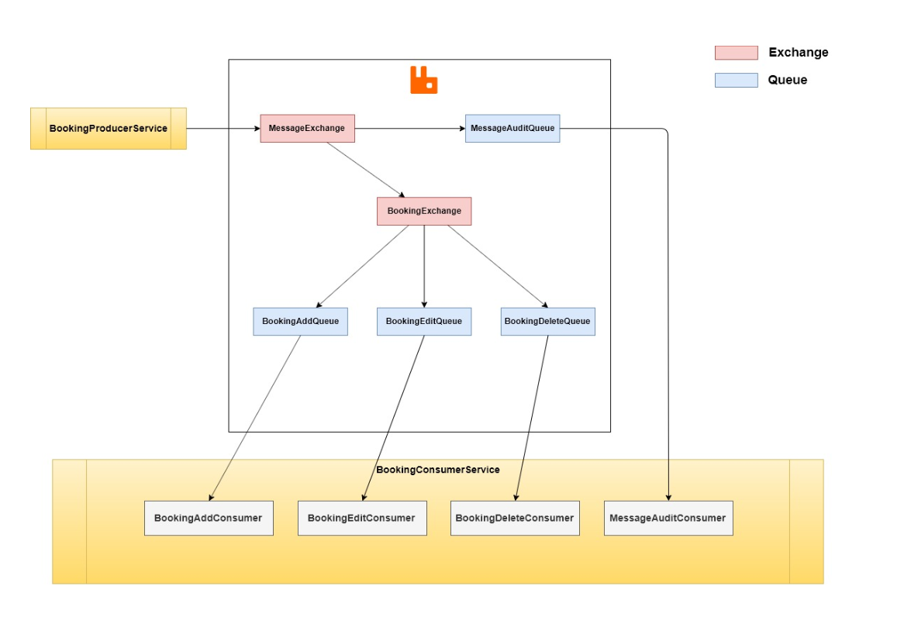
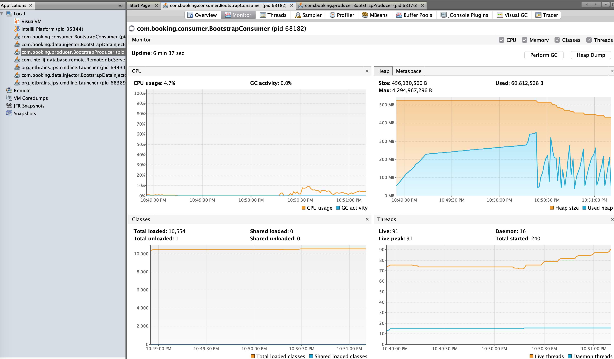
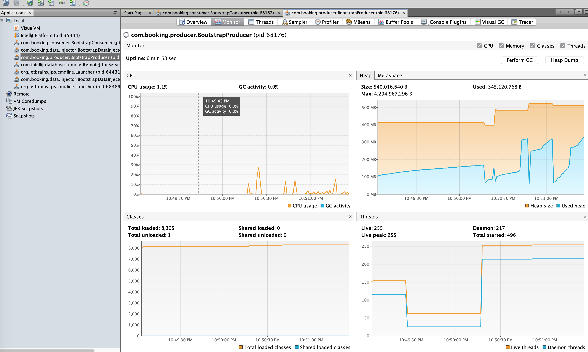
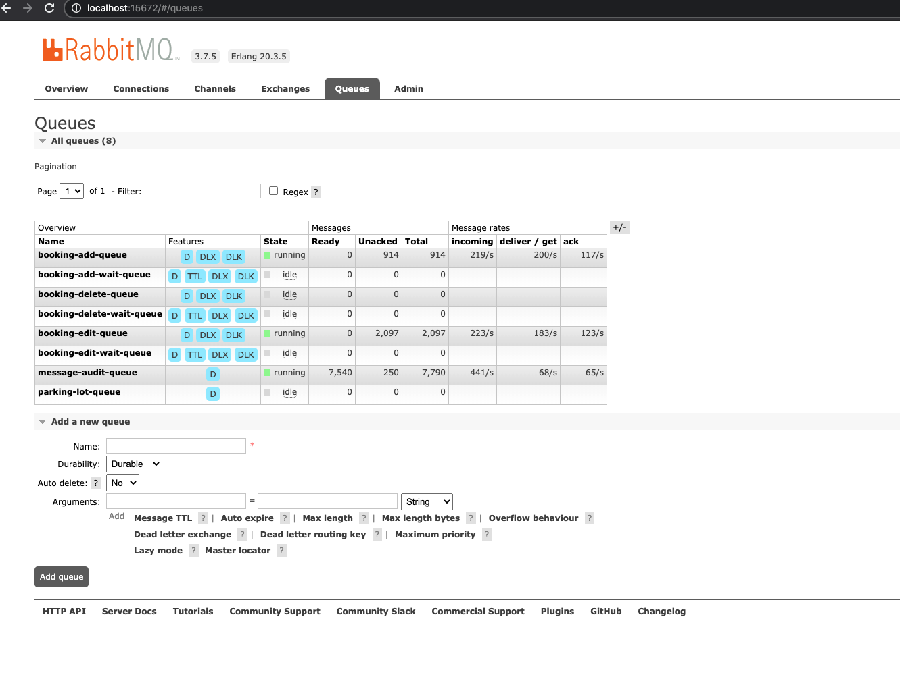
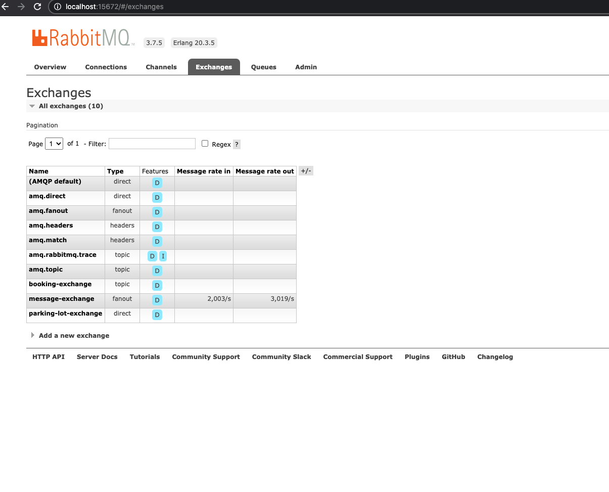

### ECABS SERVICE

##### Assignee: Nikolaos Christidis (nick.christidis@yahoo.com)

#### Infrastructure

* RabbitMQ
* PostgreSQL

In order to start the infrastructure, execute: `docker-compose up`, you can see more info
at: [docker-compose.yml](docker-compose.yml) file

#### Modules

* [booking-common-infra](booking-common-infra) contains common infrastructure code, 
such as: DTOs, Errors, RabbitMQ queues and exchanges, etc.

* [booking-consumer](booking-consumer) contains the service code in order to consume messages from
rabbit mq and store this info to the database (postgresql).

* [booking-domain](booking-domain) contains the domain entities and repositories, that other modules use.

* [booking-producer](booking-producer) contains the service code in order to expose rest endpoints, that provide validation
on input and produce messages to rabbitmq.

* [data-injector](data-injector) contains code in order to produce traffic to the whole application-platform,
such as create booking scenario, edit booking scenario, delete booking scenario.

* [e2e-tests](e2e-tests) uses the code from module: [data-injector](data-injector) in order to test the functionality
of the whole application-platform

#### Run E2E Tests (needs infrastructure to be up)
1) You need to have run infrastructure (rabbitmq and postgresql), producer and consumer services also.
2) `cd data-injector/` and execute there: `mvn clean install`
2) `cd e2e-tests/`
3) `mvn clean test`

#### Building prerequisites for producer and consumer service
1) `cd booking-domain/`
2) `mvn clean install`
3) `cd booking-common-infra`
4) `mvn clean install`

#### Build and run booking-consumer (needs infrastructure to be up)
1) `cd booking-consumer/`
2) `mvn clean install`
3) `java -jar target/booking-consumer-1.0.0.jar`

##### Important Note
For consumption from RabbitMQ and saving to PostgreSQL I have applied Best-Effort 1PC(Phase Commit)
more info: `https://www.infoworld.com/article/2077963/distributed-transactions-in-spring--with-and-without-xa.html`
and consumption operations are idempotent [@IdempotentOperation](booking-consumer/src/main/java/com/booking/consumer/doc/IdempotentOperation.java)

#### Build and run booking-producer (needs infrastructure to be up)
1) `cd booking-producer/`
2) `mvn clean install`
3) `java -jar target/booking-producer-1.0.0.jar`

##### Important Note
In order to create queues and exchanges automatically (via spring bootstrapping) you should start first this
service (booking-producer)

#

#### Assignment's Diagram

#

#### Data Injector MicroBenchmark

#

#### Error Handling with Wait Queue and Parking Lot Queue

TODO: re-fire messages from parking-lot-queue via a rest endpoint.

